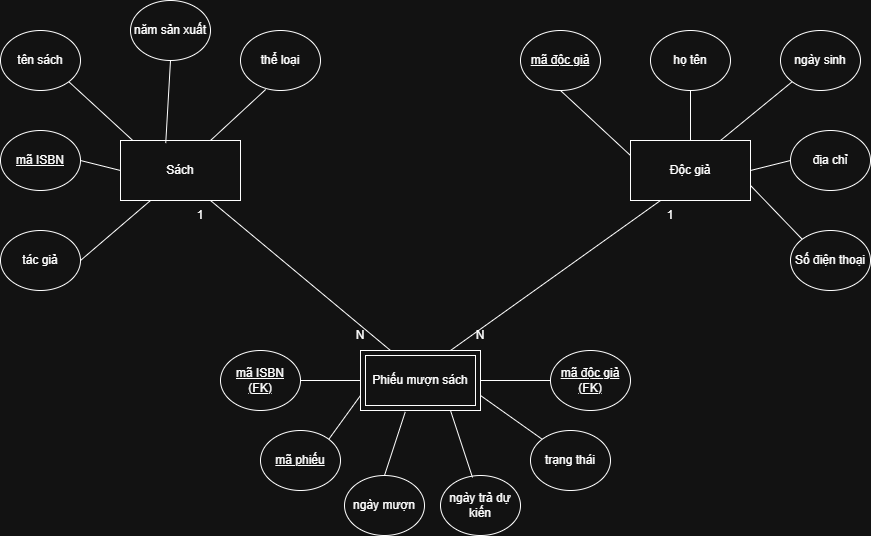

# **Xác định thực thể và thuộc tính**  
## **Mô tả**  
*Một hệ thống quản lý thư viện cần lưu trữ thông tin về:  
- Sách (bao gồm tên sách, mã ISBN, tác giả, năm xuất bản, thể loại)  
- Độc giả (bao gồm mã độc giả, họ tên, ngày sinh, địa chỉ, số điện thoại)  
- Phiếu mượn sách (gồm mã phiếu, ngày mượn, ngày trả dự kiến, trạng thái)  

### **1. Xác định các thực thể chính trong hệ thống**  
Các thực thể chính: Sách, độc giả, phiếu mượn sách  

### **2. Liệt kê thuộc tính của từng thực thể**
**- Thực thể:** Sách  
 Thuộc tính: tên sách, mã ISBN, tác giả, năm xuất bản, thể loại  
**- Thực thể:** Độc giả  
 Thuộc tính: mã độc giả, họ tên, ngày sinh, địa chỉ, số điện thoại  
**- Thực thể:** Phiếu mượn sách  
 Thuộc tính: mã phiếu, ngày mượn, ngày trả dự kiến, trạng thái  

### **3. Phân loại thuộc tính nào là khóa chính (Primary Key) và thuộc tính nào là khóa ngoại (Foreign Key) nếu có**  
Thuộc tính là khóa chính: mã ISBN, mã độc giả, mã phiếu  
Thuộc tính là khóa ngoại: mã ISBN, mã độc giả

### **4. Vẽ sơ đồ ERD và các quan hệ giữa các thực thể**
  